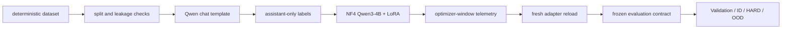

# CauseTune

## Controlled LLM Post-Training Experiments

CauseTune is an engineering lab for measuring how controlled changes in LLM post-training affect optimization behavior, failure modes, and held-out generalization.

## Why CauseTune exists

The project asks questions that train loss alone cannot answer:

- Did the model actually improve?
- Did it merely memorize the training distribution?
- Did optimization introduce new failure modes?
- Can a failure be causally attributed to one training variable?
- What happens under limited GPU memory?

The benchmark is synthetic and structured around customer-support intent classification. It is an experiment instrument, not a claim about production traffic.

## Headline result

The following values are intent accuracy:

| Experiment | Validation | ID | HARD | OOD |
| --- | ---: | ---: | ---: | ---: |
| Base Qwen3-4B | 88.0% | 83.6% | 76.8% | 79.6% |
| M5 QLoRA — unshuffled | 26.8% | 24.8% | 23.6% | 20.0% |
| M6 QLoRA — deterministic shuffle | 99.2% | 97.2% | 96.0% | 92.0% |

The dataset was class-balanced, but M5 still failed because its examples were class-contiguous and the DataLoader used `shuffle=False`. With microbatch `1` and gradient accumulation `8`, every effective optimizer window contained examples from one class. All 250/250 M5 optimizer windows were single-class; the final 25 optimizer updates contained only `wrong_item` examples. The model catastrophically recentered on the terminal class.

M6 changed only the deterministic training order. All 250 optimizer windows became mixed-class and the collapse disappeared. No replacement collapse to another single class occurred.

## The causal experiment

```text
M5: shuffle=False
M6: shuffle=True, seed=42
Everything else: unchanged
```

This one-variable comparison supports causal attribution to training order while keeping the dataset, model, quantization, LoRA design, optimizer settings, masking, and frozen evaluation contract fixed.

## Experimental setup

Dataset:

- 3,000 total examples: 2,000 train, 250 validation, 250 ID, 250 HARD, 250 OOD
- 10 structured intents with deterministic synthetic generation
- zero exact/normalized cross-split duplicate leakage
- OOD template-family isolation

`ID` is held-out data from the intended distribution. `HARD` concentrates confusable, ambiguous, multi-issue, and deliberately difficult cases. `OOD` holds out surface/template families to test wording generalization. None of these labels imply production representativeness.

## Model configuration

- Qwen/Qwen3-4B
- NF4 4-bit base weights
- BF16 compute
- bitsandbytes double quantization
- PEFT LoRA, `r=16`, `alpha=32`, `dropout=0`
- targets: `q_proj`, `k_proj`, `v_proj`, `o_proj`, `gate_proj`, `up_proj`, `down_proj`
- assistant-only supervision
- `enable_thinking=False`
- 1 epoch, learning rate `2e-4`
- microbatch `1`, gradient accumulation `8`, effective batch `8`
- 250 optimizer steps

Logical parameters: `4,055,498,240`<br>
Trainable parameters: `33,030,144` (`~0.814453%`)

Naive `sum(p.numel())` on 4-bit packed weights is a physical packed-parameter count, not the logical Qwen3-4B parameter count. The implementation uses the PEFT logical parameter API for structure checks.

## Hardware

- NVIDIA RTX 5070 Laptop GPU
- 7.96 GiB usable VRAM
- WSL2 Ubuntu 24.04

Measured M6 telemetry:

- 292,899 input tokens
- 16,800 supervised assistant tokens
- 1,773.73 s training duration
- 9.4716 supervised tok/s
- 165.132 input tok/s
- peak allocated VRAM: 4.427 GiB
- peak reserved VRAM: 4.770 GiB

## Training dynamics

M6 validation accuracy progression:

| Step | 0 | 25 | 50 | 75 | 100 | 125 | 150 | 175 | 200 | 225 | 250 |
| ---: | ---: | ---: | ---: | ---: | ---: | ---: | ---: | ---: | ---: | ---: | ---: |
| Accuracy | 88.4% | 99.2% | 100.0% | 100.0% | 100.0% | 100.0% | 100.0% | 100.0% | 100.0% | 99.6% | 99.2% |

The small late-epoch validation regression suggests that checkpoint selection or early stopping is a future experiment, not a conclusion already tested here.

## Failure analysis

M5 → M6 wrong-item collapse recovery on the key HARD cases:

| Expected intent → `wrong_item` | M5 | M6 |
| --- | ---: | ---: |
| `duplicate_charge` | 100 | 0 |
| `fraud_suspected` | 100 | 1 |
| `order_missing` | 100 | 6 |
| `refund` | 99 | 1 |
| `cancel_order` | 98 | 2 |

No replacement collapse to another single class occurred. `order_missing` remained the hardest class, especially on HARD/OOD examples; this release does not tune against that observation.

## Evaluation integrity

Base and tuned models use the same frozen evaluation contract: the same task instruction, Qwen chat formatting, `enable_thinking=False`, strict JSON schema, and no-repair parsing. Invalid outputs remain incorrect. Test splits were excluded from training, and M6 was evaluated after a fresh base-model plus adapter reload.

Dataset fingerprint: `0efaacae27cbfeb1c304c8ee359384239d4526470a32aded8f0eda39908e9d06`<br>
Frozen evaluation fingerprint: `1b00a333c26c4cbd03b3e04d990fad3b4adf0d9a03443c9fd5f183ee7e8ef94d`



## Repository layout

```text
configs/          resolved experiment and evaluation configuration
docs/             experiment history and methodology
results/          concise, verified public evidence
scripts/          dataset, audit, training, and evaluation entrypoints
src/causetune/     reusable package code
tests/            CPU-safe regression tests
```

## Quick verification

These commands do not launch GPU training:

```bash
python -m pip install -e ".[dev]"
python -m compileall -q src scripts tests
pytest -q
git diff --check
```

Dataset inspection and validation scripts are also CPU-safe. The GPU entrypoints are `scripts/run_base_baseline.py`, `scripts/run_realistic_qlora.py`, and `scripts/run_realistic_qlora_m6.py`; they load Qwen3-4B and require a compatible CUDA environment. They are historical experiment entrypoints, not commands to repeat casually.

## Limitations

- The benchmark is synthetic, not production traffic.
- Only one base model family has been studied.
- Results come from one GPU environment and one deterministic M6 seed.
- ID/HARD/OOD sets have now been observed and should not be repeatedly reused for future hyperparameter or model selection.
- The measured gains do not establish generalization to customer-support production traffic.

## Future work

Open questions include validation-based checkpoint selection, learning-rate sensitivity, LoRA rank/target ablations, a fresh untouched final benchmark, additional model families, real domain datasets, and larger post-training methods. These are future experiments, not completed work in this release.
